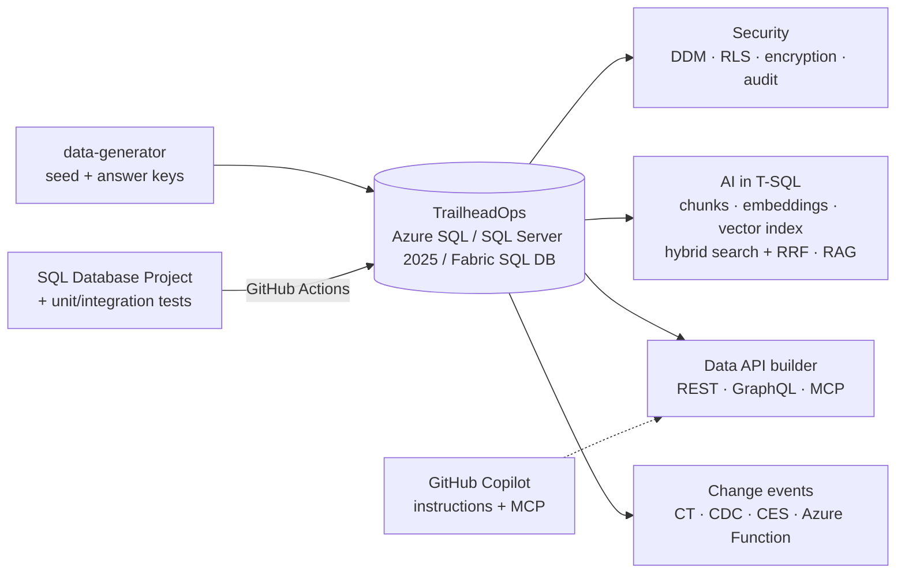

# DP-800 SQL AI Developer — Hands-on Labs

[](https://learn.microsoft.com/en-us/users/sommya-4680/credentials/fcdbd765e682a3e9)

## Why I built this

I recently passed the DP-800 exam (*Developing AI-Enabled Database Solutions*).
Passing a certification shows you know the concepts. I don't think the claim
is complete until you've worked directly with the code: written the T-SQL,
broken things, fixed them, and seen how the pieces behave together.

So I turned every DP-800 skill into something I can run. It's a single
fictional retailer, **Trailhead Outfitters**, taken from schema design and
advanced T-SQL through security, performance tuning, CI/CD with SQL Database
Projects, and Data API builder (REST, GraphQL, MCP), to embeddings, vector and
hybrid search, and RAG, all inside the database.


A complete, runnable project for **DP-800 · Developing AI-Enabled Database Solutions**: one fictional retailer's database, built from schema to AI search, with CI/CD and an API/MCP layer in front.



## Repository layout

```
sql/                    labs 01-11 (re-runnable, heavily commented); 02_seed_data.sql is generated
solutions/              answers to the "Your turn" exercises
database-project/       SDK-style SQL project, reference data, tests (CI target)
data-api-builder/       dab-config.json (+ Development override), Dockerfile, README
azure-function/         SQL trigger binding -> embeddings (Change Tracking based)
copilot/                Copilot instruction file + VS Code MCP config
data-generator/         regenerate the seed / answer keys (Python standard library only)
.github/workflows/      build, test, gated deploy, drift detection
SKILLS_MAP.md           every DP-800 skill -> file / lab step
```

## Quick start

1. Create an empty database `TrailheadOps` (Azure SQL free offer is enough).
2. Run `sql/01_schema.sql`, then `sql/02_seed_data.sql`.
3. Continue with `sql/03_programmability.sql` and follow the lab table below.

Related: the Fabric data engineering / analytics labs (DP-700, DP-600) use the same company and data in a companion repo.

---

## The labs

You build the operational database for **Trailhead Outfitters** (a fictional outdoor-gear retailer in the Baltics, Nordics and Central Europe), then secure it, tune it, ship it with CI/CD, put an API and MCP server in front of it, and add embeddings, vector/hybrid search and RAG — all in T-SQL.

Every exam bullet from the DP-800 study guide (skills measured as of October 19, 2026) is mapped to a file in [`SKILLS_MAP.md`](SKILLS_MAP.md).

## Pick a database (one is enough)

| Option | Cost | Covers | Notes |
|---|---|---|---|
| **Azure SQL Database free offer** (recommended) | free monthly allowance, auto-pauses when used up | everything except in-memory OLTP | Managed identity, auditing, Query Performance Insight, full-text, latest vector index |
| **SQL Server 2025 Developer** in Docker (VS Code MSSQL extension → *Create local SQL container*) | free | everything incl. in-memory, server audit | Vector index/`VECTOR_SEARCH` and fuzzy functions are preview (`PREVIEW_FEATURES = ON`); full-text needs a custom image with `mssql-server-fts`; no managed identity |
| **SQL database in Microsoft Fabric** | Fabric capacity / trial | most labs; data mirrors to OneLake automatically (bridges into DP-700) | No ledger, in-memory, Always Encrypted or CDC; Entra principals only |

Tools: VS Code + MSSQL extension (or SSMS 21+), GitHub Copilot, .NET 8 SDK (for the SQL project and Data API builder), Python 3.11+ (for the data generator).

## Labs

Run the scripts in order in a database named `TrailheadOps`. Each script is re-runnable and heavily commented; read the comments — they carry the exam reasoning.

| # | File | What you do | ~Time |
|---|---|---|---|
| 1 | `sql/01_schema.sql` | Tables, constraints, sequence, JSON + JSON index, temporal, ledger, graph, partitioned columnstore | 45m |
| 2 | `sql/02_seed_data.sql` | Load ~1.5k customers, 240 products, 4.3k orders, 1.4k reviews, 220 tickets (generated) | 5m |
| 3 | `sql/03_programmability.sql` | Views (incl. indexed), scalar/inline/multi-statement functions, procedures with TRY/CATCH + THROW, triggers | 45m |
| 4 | `sql/04_advanced_tsql.sql` | CTEs, window functions, JSON, REGEXP_*, fuzzy matching, graph MATCH/SHORTEST_PATH, correlated queries, temporal, error handling | 90m |
| 4b | `copilot/` | GitHub Copilot + instruction files + MCP servers (see below) | 30m |
| 5 | `sql/05_security.sql` | Roles, column permissions, DDM, RLS, column encryption, Always Encrypted (wizard), auditing | 60m |
| 6 | `sql/06_performance.sql` | Configs, plans, DMVs, Query Store, isolation levels, blocking & deadlocks (two windows), partition maintenance | 75m |
| 7 | `sql/07_embeddings.sql` | External model, chunking, embeddings, maintenance via trigger and Change Tracking | 60m |
| 8 | `sql/08_vector_search.sql` | Vector type, distance metrics, KNN vs ANN, vector index, recall@10 evaluation | 45m |
| 9 | `sql/09_hybrid_search.sql` | Full-text, hybrid search with RRF, strategy comparison | 45m |
| 10 | `sql/10_rag.sql` | RAG with `sp_invoke_external_rest_endpoint`, structured output, JSON extraction | 45m |
| 10b | `data-api-builder/` | REST + GraphQL + MCP endpoints, security, deployment | 60m |
| 11 | `sql/11_change_events_and_monitoring.sql` + `azure-function/` | Change Tracking, CDC, change event streaming, Functions SQL trigger, Azure Monitor | 60m |
| 12 | `database-project/` + `.github/workflows/sql-database-project.yml` | SDK-style SQL project, tests, CI, gated deploy, drift detection | 90m |

`02_seed_data.sql` is generated. To regenerate with different volumes: `python data-generator/generate_data.py --sql-seed sql/02_seed_data.sql`.

### No AI service? Still do labs 7-10

`07_embeddings.sql` has an offline path (`EmbeddingMode = 'toy'`): a hashing bag-of-words function produces `vector(768)` values so you can practise vector types, indexes, `VECTOR_SEARCH`, hybrid search and RRF with zero cost. It is lexical, not semantic — the difference becomes obvious when you switch to a real model (Azure OpenAI/Foundry `text-embedding-3-small` with `dimensions = 768`, or Ollama `nomic-embed-text`). Lab 10 runs in **dry-run** mode and shows the exact payload it would send.

## Lab 4b — AI-assisted development with Copilot and MCP

1. **Enable**: install GitHub Copilot + Copilot Chat in VS Code. Copilot in Fabric needs a paid Fabric capacity (F2 or higher) with the Copilot tenant setting enabled by an admin; trial capacities don't include it.
2. **Instruction file**: copy `copilot/copilot-instructions.md` to `.github/copilot-instructions.md`. Ask Copilot *"write a procedure that returns a customer's last 5 orders"* with and without the file and compare (schema-qualified names, THROW, naming).
3. **Model and tools**: in Copilot Chat pick the model from the model picker; switch to *Agent* mode and open the tools menu to enable/disable individual MCP tools for the session.
4. **MCP servers**: copy `copilot/mcp.json` to `.vscode/mcp.json`.
   - `trailhead-sql` — your Data API builder SQL MCP Server (run lab 10b first).
   - `fabric-sql-endpoint` — the Fabric SQL MCP endpoint for a lakehouse SQL analytics endpoint or warehouse (preview; signs in as you and respects your Fabric permissions).
5. **Security impact** — discuss/answer before moving on:
   - Copilot sends prompt context (open files, selected code, schema, query results returned by tools) to the model service. Don't open files with secrets; use content exclusions for sensitive paths.
   - An MCP tool runs with the identity it is configured with. Give the agent a **least-privilege role** (`role_api`, read-only roles), never `db_owner`; turn off DML tools it doesn't need.
   - Tool output (review text!) can contain prompt injection. Keep tool approval prompts on; review generated DML before running it.
   - Generated code is untrusted until reviewed: run it through the same PR + CI gates as human code (lab 12).

## Lab 12 — CI/CD with SQL Database Projects

1. Push this repo to your GitHub account. Add repo secret `CI_SQL_SA_PASSWORD` (a strong password for the throwaway CI container).
2. Locally: `dotnet build database-project/TrailheadOps.sqlproj` → a `.dacpac`. Break a reference (rename a column used by a view) and watch the **build** fail — the model is validated before anything touches a database.
3. Branch protection on `main`: require a PR, require status check `build-and-test`, require review from Code Owners (`.github/CODEOWNERS`), dismiss stale approvals, block force-push.
4. **Branching + conflicts**: create `feature/a` and `feature/b`; both change `sales/StoredProcedures/usp_PlaceOrder.sql` (different parameters). Merge A, then resolve B's conflict locally, rebuild, rerun tests, push. Declarative files make conflicts object-scoped and readable.
5. **Reference data**: add a category to `Scripts/ReferenceData/Category.sql`; deploy twice and confirm the MERGE is idempotent.
6. **Secrets**: the workflow uses OIDC (`azure/login` with a federated credential) and an access token for SqlPackage — no SQL passwords for real environments. Add `AZURE_CLIENT_ID`, `AZURE_TENANT_ID`, `AZURE_SUBSCRIPTION_ID`, `SQL_SERVER` as repository *variables*, grant the app registration a database user (`CREATE USER [<app>] FROM EXTERNAL PROVIDER` + `db_ddladmin`/`db_datawriter`).
7. **Approvals**: Settings → Environments → `production`: required reviewers, wait timer, deployment branches = `main`. The deploy job pauses until approved; the generated `deploy.sql` artifact is what reviewers read.
8. **Drift**: change something directly in production (`ALTER TABLE ... ADD`), run the workflow manually → the drift job fails with a DeployReport showing the difference. Decide: bring it into the project, or let the next deploy remove it.

## Check yourself (exam-style)

- Why does `sales.usp_PlaceOrder` use `SET XACT_ABORT ON` and still have a CATCH block?
- A user can see masked e-mails but finds customers whose e-mail starts with "a". Which feature failed, and what should you use instead?
- Your RLS predicate works for analysts but the API sees no rows. What does the API connection need?
- When would you choose KNN over ANN even with a vector index available?
- Why don't you add BM25 and cosine scores together, and what does RRF use instead?
- Which embedding maintenance method keeps the model call out of the write transaction and runs near real time?
- What does `/p:BlockOnPossibleDataLoss=True` protect against, and why is it off in the CI container?


## Useful references

| Resource | Use it for |
|---|---|
| [DP-800 study guide](https://learn.microsoft.com/en-us/credentials/certifications/resources/study-guides/dp-800) | Current skills measured + change log |
| [Azure-Samples/azure-sql-db-vector-search](https://github.com/Azure-Samples/azure-sql-db-vector-search) | More vector, DiskANN, hybrid search and RAG samples |
| [Azure-Samples/azure-sql-db-openai](https://github.com/Azure-Samples/azure-sql-db-openai) | Azure OpenAI embeddings inside Azure SQL |
| [Data API builder docs](https://learn.microsoft.com/en-us/azure/data-api-builder/) | Config reference, SQL MCP Server |

## Disclaimer

Trailhead Outfitters, its brands, people and data are fictional. Some features are preview on some platforms (noted in the scripts); when a statement fails, check the docs for your platform version. Not affiliated with Microsoft.
