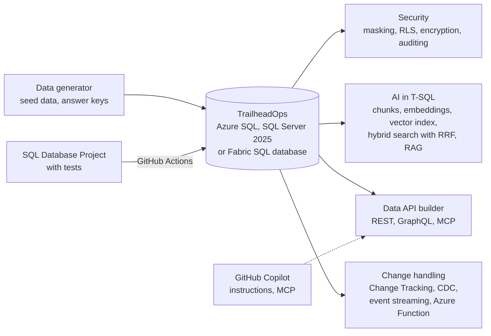

# DP-800 SQL AI Developer: Hands-on Labs

[](https://learn.microsoft.com/en-us/users/sommya-4680/credentials/fcdbd765e682a3e9)

## Why I built this

I recently passed the DP-800 exam (*Developing AI-Enabled Database Solutions*). Passing a certification shows you know the concepts, but I don't think the claim is complete until you've worked directly with the code: written the T-SQL, broken things, fixed them, and seen how the pieces behave together.

So I turned every DP-800 skill into something I can run. The labs follow one fictional retailer, Trailhead Outfitters, from schema design and advanced T-SQL through security, performance tuning, CI/CD with SQL Database Projects and Data API builder (REST, GraphQL, MCP), to embeddings, vector and hybrid search, and RAG inside the database.

## What's in the project

Everything runs against one database, `TrailheadOps`. Its customers, products, orders, reviews and support tickets come from a small data generator, so there's enough data to search and tune but it still fits in the Azure SQL free tier.



## Before you start

### Pick a database

You only need one of these.

| Option | Cost | What works | Watch out for |
|---|---|---|---|
| Azure SQL Database free offer (recommended) | Free monthly allowance; auto-pauses when it's used up | Every lab except in-memory OLTP, which isn't available on the free General Purpose tier | Nothing major. Managed identity, auditing, Query Performance Insight, full-text search and the latest vector index all work. |
| SQL Server 2025 Developer in Docker (VS Code MSSQL extension → *Create local SQL container*) | Free | Every lab, including in-memory OLTP and server audit | Vector index and `VECTOR_SEARCH` are preview (`PREVIEW_FEATURES = ON`). Full-text search needs a custom image with `mssql-server-fts`. Managed identity only works when the server is connected to Azure Arc. |
| SQL database in Microsoft Fabric | Fabric capacity or trial | Most labs. Data also mirrors to OneLake automatically. | No ledger tables, in-memory OLTP, Always Encrypted or CDC. Full-text search is preview. Only Microsoft Entra logins. |

The fuzzy-matching functions (`EDIT_DISTANCE`, `JARO_WINKLER_*`) are preview on every platform.

### Tools

- VS Code with the MSSQL extension, or SSMS 21 or later
- .NET 8 SDK, for the SQL project (lab 12) and Data API builder (lab 10b)
- GitHub Copilot, for lab 4b
- Python 3.11 or later, only if you want to regenerate the data

## Quick start

1. Create an empty database called `TrailheadOps`.
2. Run `sql/01_schema.sql`, then `sql/02_seed_data.sql`.
3. Work through the labs below in order.

## Labs

Run the scripts in order. The explanations are in the comments inside each script, so read them as you go. Most scripts can be run more than once; if the database ends up in a bad state, run `01_schema.sql` and `02_seed_data.sql` again to reset it.

| # | Where | What you do | Time (approx.) |
|---|---|---|---|
| 1 | `sql/01_schema.sql` | Tables, constraints, a sequence, JSON with a JSON index, temporal, ledger and graph tables, a partitioned columnstore table | 45 min |
| 2 | `sql/02_seed_data.sql` | Load about 1.5k customers, 240 products, 4.4k orders, 1.4k reviews and 220 support tickets | 5 min |
| 3 | `sql/03_programmability.sql` | Views (including an indexed view), scalar and table-valued functions, procedures with TRY/CATCH and THROW, triggers | 45 min |
| 4 | `sql/04_advanced_tsql.sql` | CTEs, window functions, JSON, regular expressions, fuzzy matching, graph queries, correlated queries, temporal queries, error handling | 90 min |
| 4b | `copilot/` | GitHub Copilot, instruction files and MCP servers ([details](#lab-4b-ai-assisted-development-with-copilot-and-mcp)) | 30 min |
| 5 | `sql/05_security.sql` | Roles, column permissions, dynamic data masking, row-level security, column encryption, Always Encrypted, auditing | 60 min |
| 6 | `sql/06_performance.sql` | Configuration, execution plans, DMVs, Query Store, isolation levels, blocking and deadlocks (needs two query windows), partition maintenance | 75 min |
| 7 | `sql/07_embeddings.sql` | External model, chunking, embeddings, keeping embeddings up to date with a trigger and Change Tracking | 60 min |
| 8 | `sql/08_vector_search.sql` | Vector type, distance metrics, exact vs. approximate search, vector index, recall measurement | 45 min |
| 9 | `sql/09_hybrid_search.sql` | Full-text search, hybrid search with reciprocal rank fusion, comparing strategies | 45 min |
| 10 | `sql/10_rag.sql` | RAG with `sp_invoke_external_rest_endpoint`, structured output, reading the response | 45 min |
| 10b | `data-api-builder/` | REST, GraphQL and MCP endpoints, securing them, deployment ([details](#lab-10b-data-api-builder)) | 60 min |
| 11 | `sql/11_change_events_and_monitoring.sql`, `azure-function/` | Change Tracking, CDC, change event streaming, an Azure Function with a SQL trigger, Azure Monitor | 60 min |
| 12 | `database-project/`, `.github/workflows/` | SDK-style SQL project, tests, CI, approved deployments, drift detection ([details](#lab-12-cicd-with-sql-database-projects)) | 90 min |

Labs 4b and 10b don't have their own SQL script, and lab 12 is mostly GitHub setup, so those three are described in their own sections below.

The partition-maintenance part of lab 6 changes the partition boundaries, so it only works once; reset the database before running it again.

To change the data volume, regenerate the seed with `python data-generator/generate_data.py --sql-seed sql/02_seed_data.sql`.

### No AI service?

You can still do labs 7 to 10. `07_embeddings.sql` has an offline mode (`EmbeddingMode = 'toy'`) that builds `vector(768)` values from a simple word-hashing function, so vector types, indexes, `VECTOR_SEARCH`, hybrid search and RRF all work at no cost. The results behave like keyword search rather than semantic search. The difference is obvious once you switch to a real embedding model, either Azure OpenAI / Foundry `text-embedding-3-small` with `dimensions = 768` or Ollama `nomic-embed-text`. Lab 10 runs in dry-run mode by default and shows the request it would send.

## Lab 4b: AI-assisted development with Copilot and MCP

Do steps 1 to 3 after lab 4. Steps 4 and 5 use the API from lab 10b and the roles from lab 5, so come back to them later.

1. Install GitHub Copilot and Copilot Chat in VS Code. Copilot in Fabric needs a paid Fabric capacity and the Copilot tenant setting turned on by an admin; check the Fabric Copilot docs for current requirements.
2. Copy `copilot/copilot-instructions.md` to `.github/copilot-instructions.md`. Ask Copilot to "write a procedure that returns a customer's last 5 orders", once with the file and once without, and compare naming, schema prefixes and error handling.
3. In Copilot Chat, choose a model from the model picker, switch to Agent mode, and use the tools menu to turn individual MCP tools on or off.
4. Copy `copilot/mcp.json` to `.vscode/mcp.json`. It defines three servers:
   - `trailhead-sql`: the Data API builder MCP endpoint over HTTP (start Data API builder first)
   - `trailhead-sql-stdio`: the same server, started by VS Code over stdio
   - `fabric-sql-endpoint`: the Fabric SQL MCP endpoint for a lakehouse SQL analytics endpoint or warehouse (preview; it signs in as you and respects your Fabric permissions)
5. Think through the security side:
   - Copilot sends context to the model service: open files, selected code, schema and any query results that tools return. Keep secrets out of open files and use content exclusions for sensitive paths.
   - An MCP tool runs with whatever identity it's configured with. Give it a least-privilege role such as `role_api` from lab 5, never `db_owner`, and turn off write tools it doesn't need.
   - Tool output can contain prompt injection, because review text is written by users. Keep tool approval prompts on and review generated DML before running it.
   - Treat generated code like any other change: it goes through the same pull request and CI checks as lab 12.

## Lab 10b: Data API builder

Setup, example requests, a security checklist and deployment steps are in [`data-api-builder/README.md`](data-api-builder/README.md). The config exposes categories, products, reviews and an order summary as REST and GraphQL endpoints, and the place-order and search procedures as MCP tools.

## Lab 12: CI/CD with SQL Database Projects

The workflow in `.github/workflows/sql-database-project.yml` builds the project, deploys it to a temporary SQL Server 2025 container and runs the tests. On `main`, it then deploys to Azure SQL after an approval. A scheduled job checks production for schema drift.

1. Fork the repo and add a repository secret `CI_SQL_SA_PASSWORD`, a strong password for the temporary CI container.
2. Build locally with `dotnet build database-project/TrailheadOps.sqlproj`. Then rename a column that a view uses and build again: the build fails before anything touches a database.
3. Protect `main`: require a pull request, the `build-and-test` status check and a review from code owners (`.github/CODEOWNERS`). The workflow only runs when `database-project/` changes, so if you make `build-and-test` required, remove the `paths:` filter from the `pull_request` trigger. Otherwise pull requests that don't touch the project wait for a check that never runs.
4. Practise a merge conflict: create `feature/a` and `feature/b`, change `database-project/sales/StoredProcedures/usp_PlaceOrder.sql` differently in each, merge A, then resolve B locally, rebuild and rerun the tests.
5. Add a category to `database-project/Scripts/ReferenceData/Category.sql` and publish twice. The second publish should change nothing, because the post-deployment MERGE only inserts or updates what differs.
6. Set up passwordless deployment to Azure SQL:
   - Create an Entra app registration with federated credentials for this repo's `production` and `production-readonly` environments (the deploy job uses the first, the drift job the second).
   - Add `AZURE_CLIENT_ID`, `AZURE_TENANT_ID`, `AZURE_SUBSCRIPTION_ID` and `SQL_SERVER` (for example `myserver.database.windows.net`) as repository variables.
   - In the database, run `CREATE USER [<app-name>] FROM EXTERNAL PROVIDER;`, add the user to `db_ddladmin`, `db_datareader` and `db_datawriter`, and grant it `VIEW DEFINITION`.
7. Under Settings → Environments → `production`, add yourself as a required reviewer and limit deployments to `main`. The deploy job then waits for approval, and you can read the generated `deploy.sql` artifact before approving.
8. Test drift detection: change something directly in the production database (for example with `ALTER TABLE ... ADD`), then run the workflow manually. The drift job fails and its report shows the difference. Either add the change to the project or remove it from the database yourself. The deployment is configured not to drop objects that aren't in the project and to stop if it could lose data, so it won't clean up drift on its own.

## Check yourself

- Why does `sales.usp_PlaceOrder` set `XACT_ABORT ON` and still have a CATCH block?
- A user who only sees masked e-mail addresses can still find customers whose e-mail starts with "a". Why, and what would actually protect the data?
- Row-level security works for analysts, but the API sees no rows. What does the API connection need to send?
- When would you choose exact (KNN) search over approximate (ANN) search even though a vector index exists?
- Why can't you simply add full-text (BM25) and cosine scores together, and what does RRF use instead?
- Which embedding maintenance method keeps the model call out of the write transaction and still runs in near real time?
- What does `/p:BlockOnPossibleDataLoss=True` protect against, and why is it turned off for the CI container?

## Repository layout

```
sql/                labs 01-11; 02_seed_data.sql is generated
solutions/          answers to the lab 4 exercises
database-project/   SDK-style SQL project, reference data and tests (lab 12)
data-api-builder/   Data API builder config, Dockerfile and guide (lab 10b)
azure-function/     SQL trigger binding that refreshes embeddings (lab 11)
copilot/            Copilot instruction file and VS Code MCP config (lab 4b)
data-generator/     regenerates the seed data and answer keys
.github/            CI/CD workflow and CODEOWNERS
SKILLS_MAP.md       every DP-800 skill mapped to a file or lab step
```

<!--
Uncomment and fill these in as you run the labs.

## What I learned

-

## Results

Screenshots from my own runs (saved in docs/screenshots/):

-
-->

## References

- [DP-800 study guide](https://learn.microsoft.com/en-us/credentials/certifications/resources/study-guides/dp-800): current skills measured and change log
- [Azure-Samples/azure-sql-db-vector-search](https://github.com/Azure-Samples/azure-sql-db-vector-search): Microsoft's samples for vectors, DiskANN, hybrid search and RAG
- [Azure-Samples/azure-sql-db-openai](https://github.com/Azure-Samples/azure-sql-db-openai): Azure OpenAI embeddings inside Azure SQL
- [Data API builder docs](https://learn.microsoft.com/en-us/azure/data-api-builder/): configuration reference and SQL MCP Server

The DP-700 and DP-600 labs use the same company and data in a separate repo.

## Disclaimer

Trailhead Outfitters and all of its data are fictional. Some features used here are in preview on some platforms (the scripts point these out), so syntax can change; if a statement fails, check the docs for your platform version. This project isn't affiliated with Microsoft.
